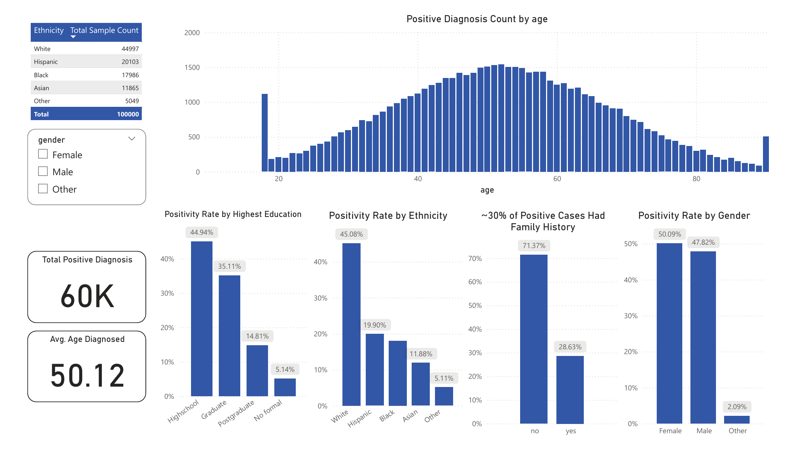
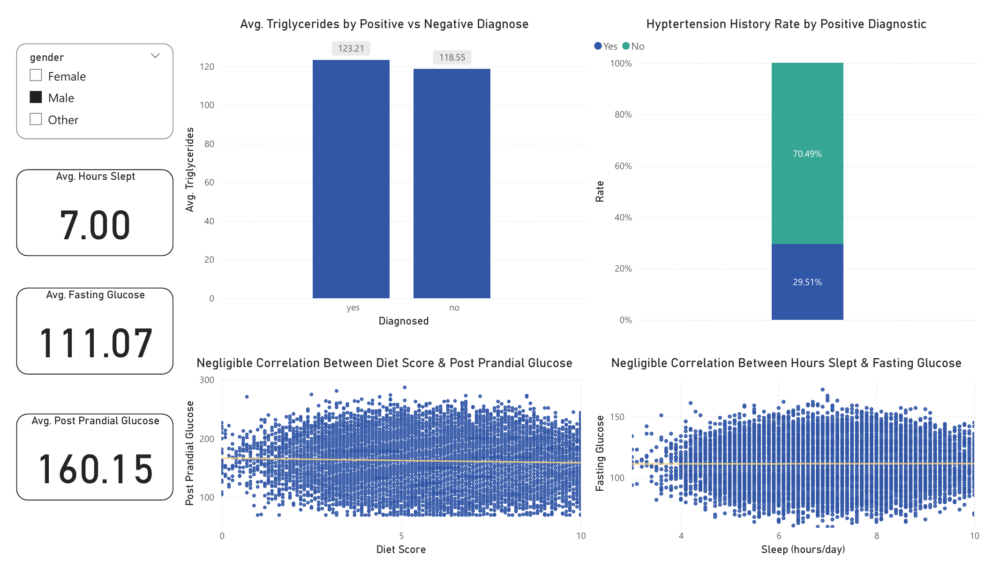
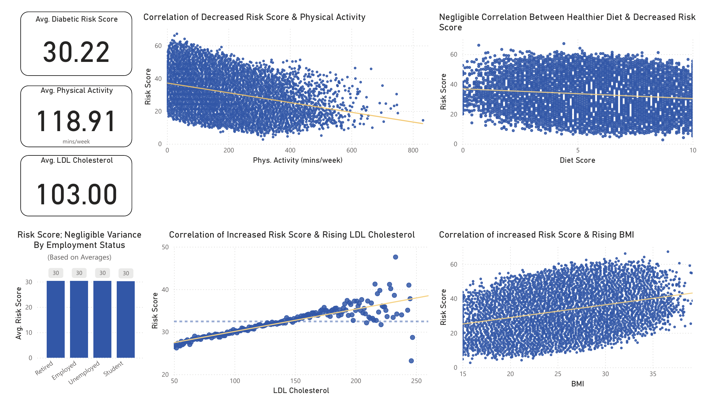
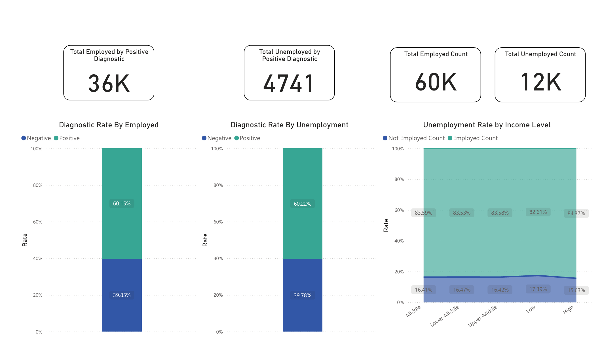

# Diabetes & Lifestyle; A Case Study  
**Author: Andrew Castro**  

---

## Dataset Source  

The Diabetes Sale data was downloaded from a publicly sourced dataset on [Kaggle](https://www.kaggle.com/). I first imported it into Microsoft Excel to analyze the Column Dictionary available, which notably contained the following columns:  

`age`, `gender`, `ethnicity`, `education_level`, `income_level`, `employment_status`, `smoking_status`, `alcohol_consumption_per_week`, `physical_activity_minutes_per_week`, `diet_score`, `sleep_hours_per_day`, `screen_time_hours_per_day`, `family_history_diabetes`, `hypertension_history`, `cardiovascular_history`, `bmi`, `waist_to_hip_ratio`, `systolic_bp`, `diastolic_bp`, `heart_rate`, `cholesterol_total`, `hdl_cholesterol`, `ldl_cholesterol`, `triglycerides`, `glucose_fasting`, `glucose_postprandial`, `insulin_level`, `hba1c`, `diabetes_risk_score`, `diabetes_stage`, `diagnosed_diabetes`  

---

## Hypotheses  

- Hypothesis: Weekly exercise will reduce an individual’s diabetes risk score.  
- Hypothesis 2: Poor diet ratings will positively correlate with higher post-prandial glucose scores.  

---

## EDA & Methodology  

The dataset provided multiple avenues for exploratory data analysis (EDA), focusing on demographic, lifestyle, and clinical correlations with diabetes diagnosis. It’s vital to understand that quantified analysis is based among the sampled dataset, and population bias may exist within it.  

The following sources were used to further understand the influence diabetes and the data within the dataset:  

- American Diabetes Association  
- CDC; National Statistics  

The dataset was loaded into Power BI for analysis. While initial data exploration was also performed in Python, the final interactive dashboard was developed end-to-end in Power BI, leveraging Power Query for transformations and DAX for dynamic measures.  

---

## Column Renaming & Data Transformation  

Binary fields indicated with `1` or `0` were changed to `yes` or `no` labels for their values to enhance clarity. For example, the `family_history_diabetes` and `hypertension_history` categories.  

---

## New Measures Created  

Key DAX measures were created to enable deeper analysis beyond default summaries:  

- **Positive Diagnosis Count**  
  Calculates the total count of positive diagnoses.  

- **Positivity Rate**  
  Calculates the percentage of positive diagnoses within any given subgroup, allowing for fair comparison across groups of different sizes.  

- **Unemployment Count By Negativity**  
  Calculates the count of individuals without diabetes who are unemployed.  

- **Unemployment Count By Positivity**  
  Calculates the count of individuals with diabetes who are unemployed.  

- **Not Employed Count**  
  Calculates the total number of individuals who are unemployed.  

- **Negative Diagnosis Count**  
  Calculates the count of individuals without a family history of diabetes.  

- **Hypertension History Count**  
  Calculates the count of individuals with a history of hypertension.  

- **Employment Count By Positivity**  
  Calculates the count of employed individuals who have diabetes.  

- **Employment Count By Negativity**  
  Calculates the count of employed individuals who do not have diabetes.  

- **Employed Count**  
  Calculates the total number of individuals who are employed.  

---

## Results & Dashboard  

**Hypothesis 1 (TRUE):**  
Weekly exercise does reduce an individual’s diabetes risk score.  

**Hypothesis 2 (FALSE):**  
Poor diet ratings will not positively correlate with higher post-prandial glucose scores, within our dataset.  

---

## Family History and Education  

Among individuals with a positive diabetes diagnosis, ~30% reported a family history of diabetes. This was true for 28.68% of females, 28.50% of males, and 30.43% of non-specified genders. Individuals with unknown family history are to be expected and have also decreased this total percentage. Education level displayed a clear inverse correlation with diabetes rates. Positivity rates were highest (44.90%) among those with a High school education level, and lowest (14.80%) among those with a Postgraduate level. Similar correlation patterns followed income levels, affecting the middle class the most (35.04%).  

---

## Demographic Insights  

Positive diagnosis followed a typical and clear bell curve, peaking between the ages of 45-55. The average positive diagnostic age was approximately 50 years old. However, 18 and 90 year old individuals displayed clear diagnostic outliers. Positivity rate was highest among the White population (45.10%), followed by -56.50% reduction rate in the Hispanic population with a 19.90% positivity rate.  

---

## The Influence on Post Prandial Glucose  

Average post prandial glucose was recorded at 160.04mg/dl. With females being slightly below at 159.88mg/dl compared to males at 160.15mg/dl, on average. Although individuals with a poor diet score (0) averaged ~171 mg/dl post prandial glucose compared to ~166 mg/dl for those with a perfect score (10), the negligible difference suggests minimal correlation in this dataset, as both are still considered elevated blood sugar levels.  

---

## Clinical Correlations  

A clear correlation exists between an individual’s physical activity a week and reducing their risk of diabetes. Individuals with increased BMI & LDL Cholesterol levels led to escalating risks of positive diabetic diagnosis. In contradiction, improved diet scores and sleep patterns displayed negligible correlation amongst the dataset in individual improvement of their diabetic risk score.  

Those positively diagnosed with diabetes had a slightly increased triglyceride count (123.21mg/dL) compared to those who tested negative (118.55mg/dL). However, the correlation is negligible as both fall within the healthy range of below 150.00mg/dL, according to the National Heart, Lung, and Blood Institute.  

---

## Economic Relationships  

Employment status and income levels were explored to find correlation between an individual’s ability to afford a healthy lifestyle and their diabetic lifestyle. However, the positive diagnostic rate between both unemployed (39.78%) and employed (39.85%) groups were nearly identical.  

Notably, the unemployment rate by income level remained negligible across the entire middle income-level category with a low of 16.41% and a high of 16.47%. However, the low income-level saw the highest unemployment rate of 17.39%. High income-level individuals see the lowest unemployment rate of 15.63%, a -1.76% unemployment rate compared to the low income group.  

---

## Conclusion  

Physical activity significantly reduced diabetes risk, while diet score showed negligible correlation on glucose levels. LDL cholesterol and BMI emerged as strong clinical risk factors, and socioeconomic influences such as education also positively correlated with diabetes prevalence. However, it’s vital to understand that analysis and correlation is based solely on the sampled bias within the provided dataset. The exploratory data analysis revealed the importance of combining lifestyle, demographic, and clinical data to understand complex health risks.  

* LDL Cholesterol, and higher BMI are clear risk factors for diabetes in this dataset.  
* Lifestyle factors such as physical activity showed a stronger correlation than diet score in reducing risk.  
* Socioeconomic influences (education) also displayed a notable impact.  
* While this dataset has limitations, the analysis highlights the importance of both clinical and lifestyle variables in understanding diabetes risk.  
